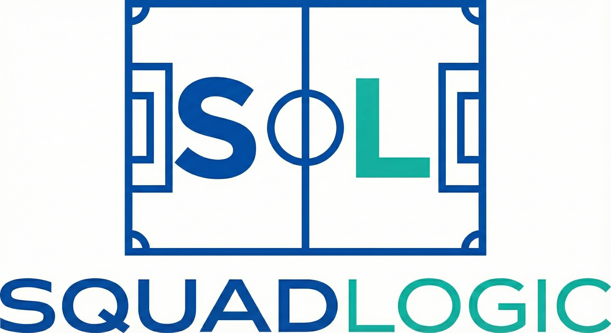

# SquadLogic



> **Focus on the Field.**
>
> SquadLogic converts raw GotSport registration data into actionable teaming and scheduling frameworks, designed specifically to support youth sports organizations.

[](https://github.com/JoelA510/SquadLogic/actions)
[](https://opensource.org/licenses/ISC)
[](https://nodejs.org/)
[](https://vitejs.dev/)

---

## 🚀 Overview

SquadLogic is a comprehensive tool for youth sports administrators. It simplifies the complex logistics of organizing leagues by automating team generation, practice scheduling, and game scheduling. Built with a modern tech stack and a "Deep Space Glass" design system, it offers a premium, intuitive user experience.

> **Status:** v1.0 GA — Phase 10 pre-flight certification complete, post-launch monitoring in effect. See [`docs/operations/production-cutover.md`](docs/operations/production-cutover.md) for launch runbook.

## ✨ Implemented Features (v1.0 MVP Complete)

SquadLogic v1.0 is feature-complete, providing a full-suite operational platform for youth sports management.

### ✅ Implemented Baseline

- **Core Domain & Utilities**: Shared packages for metrics, evaluation, normalization, and error handling.
- **Automated Team Generation**: Algorithmic allocation of players to teams honoring mutual buddy requests and coach assignments.
- **Practice & Game Scheduling Engines**: Conflict-aware round-robin generation and field/time slot allocation.
- **Evaluation Pipeline**: Automated readiness scoring, fairness metrics, and conflict detection.
- **Supabase Persistence**: Edge functions, RPCs, and transactional database schemas for saving schedules and overrides.
- **Admin Dashboard Shell**: React/Vite frontend with routing, multi-theme support (Dark/Light/Party), and data ingestion panels.
- **Role-Based Access Control (RBAC)**: Comprehensive permission enforcement across all UI flows and RLS policies.
- **Multi-Tenant Enforcement**: Strict organization partitioning ensuring data isolation.
- **Facility Management**: Full CRUD UI for Venues, Fields, and Blackout Dates.
- **Communication (M3.2)**: RSVP tracking, trigger-based notifications (Rainouts, Schedule Changes), and Team Chat.
- **Calendar Sync (M3.3)**: Public ICS feeds for parents and coaches.
- **Registration & Compliance (M3.4)**: Custom form builder, waiver tracking, and boolean compliance dashboards.
- **Reporting (M3.5)**: Game score entry, standings calculations, and tie-breaker logic.

## 🛠️ Tech Stack

- **Frontend**: React 19, Vite 6
- **Styling**: Vanilla CSS (Deep Space Glass Design System), Tailwind CSS 4
- **Backend**: Node.js, Supabase (PostgreSQL, Edge Functions, Storage, Auth)
- **Testing**: Vitest (Unit/Integration), Playwright-BDD (E2E)
- **Analysis**: TypeScript (`checkJs` + `allowJs`), ESLint (flat config), Prettier

## 🗺️ Current Routes

The application is structured around the following core admin workflows (see `App.jsx`):

- `/` - **Dashboard**: High-level metrics, roadmap progress, and workflow orchestration.
- `/import` - **Data Import**: Ingestion of GotSport CSVs (Players, Coaches, Fields).
- `/teams` - **Team Management**: Roster generation, analysis, and manual overrides.
- `/fields` - **Field Management**: Configuration of venues, sub-units, and priorities.
- `/schedule/practice` - **Practice Schedule**: Field availability mapping and practice slot assignments.
- `/schedule/game` - **Game Schedule**: Round-robin matchups and Saturday game allocations.
- `/settings` - **Settings**: League configuration, theme branding, and season management.

## 🏁 Getting Started

### Prerequisites

- Node.js (v20 or higher)
- npm (v10 or higher)
- A Supabase Project (for database and auth)

### Installation

1. **Clone the repository:**

   ```bash
   git clone [https://github.com/JoelA510/SquadLogic.git](https://github.com/JoelA510/SquadLogic.git)
   cd SquadLogic
   ```

2. **Install dependencies:**

   ```bash
   npm install
   ```

3. **Environment Setup:**
   Copy `.env.example` to `.env.local` and populate your Supabase credentials.
   For a full list of all environment variables (frontend, Edge Functions, CI/CD), see [**Environment Variables Reference**](docs/operations/ENVIRONMENT.md).

4. **Start the development server:**
   ```bash
   npm run frontend:dev
   ```
   The application will be available at `http://localhost:5173`.

### Building for Production

To create a production build:

```bash
npm run frontend:build
```

## 📄 Documentation

The SquadLogic knowledge base is organized into a categorized hierarchy for high discoverability and audit traceability. For the full index, see [**`docs/README.md`**](docs/README.md).

### 🏛️ Architecture & Core
- [**System Overview**](docs/architecture/system-overview.md): Full tech stack and system diagram.
- [**Frontend Architecture**](docs/architecture/frontend-architecture.md): Routing, hooks, and component patterns.
- [**Data Modeling**](docs/architecture/data-modeling.md): Database schema and multi-tenant isolation.
- [**Scheduling Algorithms**](docs/architecture/game-scheduling.md): Team generation and field allocation logic.

### 🛡️ Security & Governance
- [**Security Audit Plan**](docs/security/audit_and_remediation_plan.md): Hardening steps and remediation status.
- [**RLS Policies**](docs/security/rls-policies.md): Strict multi-tenant data access rules.
- [**Master Audit Certification**](docs/governance/master-audit-certification.md): Enterprise-ready production readiness report.
- [**Governance Framework**](docs/governance/governance-framework.md): RPC enforcement and Zod validation mandates.

### 🚀 Roadmap & Operations
- [**Expansion Roadmap**](docs/expansion/03_ROADMAP.md): Current sprint and milestone tracking.
- [**E2E Testing Master Plan**](docs/testing/e2e_master_plan.md): Playwright-BDD coverage and quality gates.
- [**Production Cutover**](docs/operations/production-cutover.md): Deployment runbook and environment setup.
- [**UI/UX Guidelines**](docs/ui/agent-ui-ux-guidelines.md): "Deep Space Glass" standards and accessibility requirements.

## 📄 License

This project is licensed under the [ISC License](https://opensource.org/licenses/ISC).
